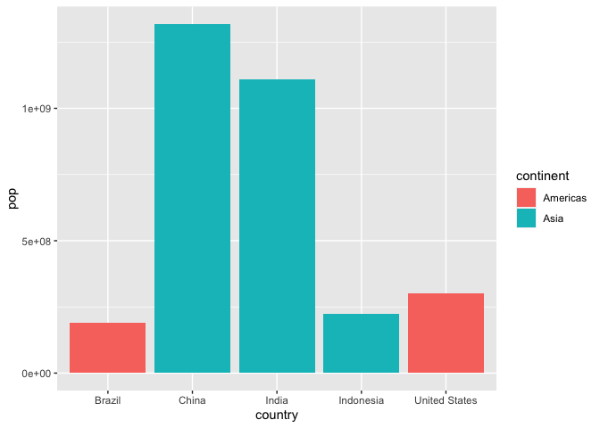
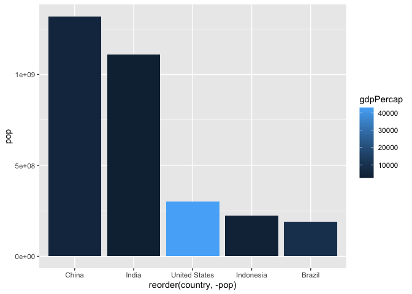

# class05: use visual markdown editor
Ebony Michelle Argaez (PID: A59026556)

## Specifying dataset w/ ggplot()

``` r
#installed ggplot2 package in terminal 'install.packages("ggplot2")'
library(ggplot2)
```

``` r
#defining data set
ggplot(cars)
```


## Specifying aesthetic mappings with aes()

``` r
ggplot(cars) + # + adds layers to plot
  aes(x=speed, y=dist) #maps variables from dataset 
```


## Specifying a geom layer w/ geom_point()

``` r
ggplot(cars) +
  aes(x=speed, y=dist) +
  geom_point() #actually plots points
```


To use ggplot I need to define the following: 1. Data 2. Aesthetics 3.
geoms

``` r
ggplot(cars) +
  aes(x=speed, y=dist) +
  geom_point() + #actually plots points 
  geom_smooth() 
```

    `geom_smooth()` using method = 'loess' and formula = 'y ~ x'


``` r
ggplot(cars) +
  aes(x=speed, y=dist) +
  geom_point() + #actually plots points 
  geom_smooth(method="lm", se=FALSE) #adds straight line w/out std. error
```

    `geom_smooth()` using formula = 'y ~ x'


``` r
ggplot(cars) +
  aes(x=speed, y=dist) +
  geom_point() + #actually plots points 
  geom_smooth(method="lm", se=FALSE) + #adds straight line w/out std. error
  labs (title = "Speed and Stopping Distances of Cars", 
        x= "speed (mph)",
        y= "stopping distance (ft)") +
  theme_bw()
```

    `geom_smooth()` using formula = 'y ~ x'


## adding more plot aesthetics through aes()

``` r
url <- "https://bioboot.github.io/bimm143_S20/class-material/up_down_expression.txt"
genes <- read.delim(url)
head(genes)
```

            Gene Condition1 Condition2      State
    1      A4GNT -3.6808610 -3.4401355 unchanging
    2       AAAS  4.5479580  4.3864126 unchanging
    3      AASDH  3.7190695  3.4787276 unchanging
    4       AATF  5.0784720  5.0151916 unchanging
    5       AATK  0.4711421  0.5598642 unchanging
    6 AB015752.4 -3.6808610 -3.5921390 unchanging

``` r
nrow(genes) #numb. of rows
```

    [1] 5196

``` r
colnames(genes) # column names
```

    [1] "Gene"       "Condition1" "Condition2" "State"     

``` r
ncol(genes) #numb. columns
```

    [1] 4

``` r
#
table(genes$State)
```


          down unchanging         up 
            72       4997        127 

``` r
round(table(genes$State)/nrow(genes)*100, 2)
```


          down unchanging         up 
          1.39      96.17       2.44 

``` r
#graphing genes, condition1 v condition2
ggplot(genes)+
  aes(x=Condition1, y= Condition2)+
  geom_point()
```


``` r
p= ggplot(genes)+
  aes(x=Condition1, y= Condition2, col= State)+
  geom_point()
p
```


``` r
#changing colors of plot points
p + scale_colour_manual(values= c("blue", "gray", "red"))
```


``` r
#adding title & axis titles
p + scale_colour_manual(values= c("blue", "gray", "red")) +
  labs(title= "Gene Expression Changes Upon Drug Treatment",
       x= "control (no drug)", 
         y= "drug treatment")
```


## Going Further

``` r
#installed gapminder package in terminal 'install.packages("gapminder")'
library(gapminder)
```

``` r
#instalation of dplyr 'install.packages("dplyr")'

library(dplyr)
```


    Attaching package: 'dplyr'

    The following objects are masked from 'package:stats':

        filter, lag

    The following objects are masked from 'package:base':

        intersect, setdiff, setequal, union

``` r
#filtering yr 2007
gapminder_2007 = gapminder %>% filter(year==2007)

#plotting gapminder_2007
ggplot(gapminder_2007)+
  aes(x= gdpPercap, y= lifeExp)+
  geom_point()
```


``` r
#changing plot point transparency
ggplot(gapminder_2007)+
  aes(x= gdpPercap, y= lifeExp)+
  geom_point(alpha=0.5)
```


## adding more variables to aes()

``` r
#accounting for other variables: color based on continent, population by size of point
ggplot(gapminder_2007)+
  aes(x= gdpPercap, y= lifeExp, color= continent, size=pop)+
  geom_point(alpha=0.5)
```


``` r
#plot when we color the points by the numeric variable population, not accounting for location aka continent
ggplot(gapminder_2007) + 
  aes(x = gdpPercap, y = lifeExp, color = pop) +
  geom_point(alpha=0.8)
```


## adjusting point size

``` r
ggplot(gapminder_2007) + 
  aes(x = gdpPercap, y = lifeExp, size = pop) +
  geom_point(alpha=0.5)
```


``` r
#the point sizes are not proportional to population amount, not representative
```

``` r
#scaling points to represent population
ggplot(gapminder_2007) + 
  aes(x = gdpPercap, y = lifeExp,
                 size = pop)+
  geom_point(alpha=0.5) + 
  scale_size_area(max_size = 10)
```


``` r
#making plot for year 1957
#filtering yr 2007
gapminder_1957 = gapminder %>% filter(year==1957)

ggplot(gapminder_1957) + 
  aes(x = gdpPercap, y = lifeExp,
                 size = pop, color= continent) +
  geom_point(alpha=0.5) + 
  scale_size_area(max_size = 10)
```


``` r
ggplot(gapminder_1957) + 
  aes(x = gdpPercap, y = lifeExp,
                 size = pop, color= continent) +
  geom_point(alpha=0.5) + 
  scale_size_area(max_size = 10)
```


``` r
gapminder_19572007 <- gapminder %>% filter(year==1957 | year==2007)

ggplot(gapminder_19572007) +
  aes(x = gdpPercap, y = lifeExp, color=continent,
                 size = pop) +
  geom_point(alpha=0.7)+
  scale_size_area(max_size = 10) +
  facet_wrap(~year)
```


## Bar Charts

``` r
gapminder_top5 <- gapminder %>% 
  filter(year==2007) %>% 
  arrange(desc(pop)) %>% 
  top_n(5, pop)

gapminder_top5
```

    # A tibble: 5 × 6
      country       continent  year lifeExp        pop gdpPercap
      <fct>         <fct>     <int>   <dbl>      <int>     <dbl>
    1 China         Asia       2007    73.0 1318683096     4959.
    2 India         Asia       2007    64.7 1110396331     2452.
    3 United States Americas   2007    78.2  301139947    42952.
    4 Indonesia     Asia       2007    70.6  223547000     3541.
    5 Brazil        Americas   2007    72.4  190010647     9066.

``` r
ggplot(gapminder_top5) + 
  geom_col(aes(x = country, y = pop))
```


``` r
ggplot(gapminder_top5) + 
  geom_col(aes(x = country, y = pop, fill = continent))
```



``` r
ggplot(gapminder_top5) + 
  geom_col(aes(x = country, y = pop, fill = lifeExp))
```


``` r
#plot pop size by country
ggplot(gapminder_top5) +
  aes(x=country, y=pop, fill=gdpPercap) +
  geom_col()
```


``` r
#change order of bars
ggplot(gapminder_top5) +
  aes(x=reorder(country, -pop), y=pop, fill=gdpPercap) +
  geom_col()
```



``` r
#fill by country
ggplot(gapminder_top5) +
  aes(x=reorder(country, -pop), y=pop, fill=country) +
  geom_col(col="gray30") +
  guides(fill="none")
```


## flipping bar charts

``` r
head(USArrests)
```

               Murder Assault UrbanPop Rape
    Alabama      13.2     236       58 21.2
    Alaska       10.0     263       48 44.5
    Arizona       8.1     294       80 31.0
    Arkansas      8.8     190       50 19.5
    California    9.0     276       91 40.6
    Colorado      7.9     204       78 38.7

``` r
USArrests$State <- rownames(USArrests)
ggplot(USArrests) +
  aes(x=reorder(State,Murder), y=Murder) +
  geom_col() +
  coord_flip()
```


``` r
#too crowded, fixing display aesthetics
ggplot(USArrests) +
  aes(x=reorder(State,Murder), y=Murder) +
  geom_point() +
  geom_segment(aes(x=State, 
                   xend=State, 
                   y=0, 
                   yend=Murder), color="blue") +
  coord_flip()
```


Installed: install.packages(“gifski”) and install.packages(“gganimate”)

``` r
library(gapminder)
library(gganimate)
```

``` r
#creating plot of gapminder data
ggplot(gapminder, aes(gdpPercap, lifeExp, size = pop, colour = country)) +
  geom_point(alpha = 0.7, show.legend = FALSE) +
  scale_colour_manual(values = country_colors) +
  scale_size(range = c(2, 12)) +
  scale_x_log10() +
  # Facet by continent
  facet_wrap(~continent) +
  # gganimate part starts here
  labs(title = 'Year: {frame_time}', x = 'GDP per capita', y = 'life expectancy') +
  transition_time(year) +
  shadow_wake(wake_length = 0.1, alpha = FALSE)
```

## combining plots

``` r
library(patchwork)
```

``` r
#setting up sample plots
p1 <- ggplot(mtcars) + geom_point(aes(mpg, disp))
p2 <- ggplot(mtcars) + geom_boxplot(aes(gear, disp, group = gear))
p3 <- ggplot(mtcars) + geom_smooth(aes(disp, qsec))
p4 <- ggplot(mtcars) + geom_bar(aes(carb))
```

``` r
#using patchwork to combine all plots
(p1 | p2 | p3) / p4
```

    `geom_smooth()` using method = 'loess' and formula = 'y ~ x'


